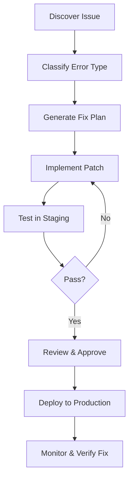

# Executive Summary  
Automated detection and remediation of authentication bugs requires a structured, end-to-end approach. First, an agent should **map the application** by crawling all pages, forms, script bundles and API endpoints, recording the login/registration paths. Concurrently it should **collect artifacts** from all layers: browser console logs, network traces (via a proxy or headless browser), and available server logs or error outputs. Analysis of these traces will surface symptoms (e.g. HTTP 4xx/5xx codes, JavaScript errors, DB exceptions). Issues can then be **prioritized** by impact: failing auth flows or security vulnerabilities rank highest. The agent’s prompt should guide it to enumerate all common error classes (client-side bugs, security misconfigurations, backend failures) and systematically test each.  

Critical practices include using up-to-date security best-practices (OWASP cheat sheets, RFCs) as a blueprint. For example, CSRF tokens and SameSite cookies should be validated as per OWASP recommendations. Passwords must use modern hashing (Argon2id/bcrypt with salt). Login and password-reset events should be logged meticulously. By combining automated crawling, testing (e.g. injecting payloads, rapid consecutive requests), and log analysis, the agent can diagnose failures (bad input validation, CORS mistakes, expired certs, etc.), generate minimal repro steps, and even propose code patches. This report presents the **full methodology**, a **taxonomy** of auth-related errors and their causes, **detection heuristics** and fixes for each, a **parameterized deep-prompt template** for the “Antigravity” AI agent, worked **examples**, a safe execution checklist, and risk estimates.  

# Methodology  

## 1. Site Crawling and Mapping  
Use an automated spider (e.g. OWASP ZAP, Burp) seeded with the site URL and credentials to enumerate pages, links, forms and APIs. Crawl in multiple modes (HTML links spidering, JS/AJAX spidering, OpenAPI specs) to discover hidden endpoints. For each page, extract forms and script bundles; identify **auth endpoints** by form actions or AJAX calls related to login/register. Fingerprint the tech stack (response headers, meta tags) to guide later fixes. Document all “entry points” – e.g. endpoints accepting credentials, tokens, or user profiles.  

## 2. Artifact Collection and Logging  
Instrument a headless browser (or proxy) to capture **client-side logs**: console errors, JavaScript exceptions, and network traces (XHR/fetch calls) during each auth flow. Enable verbose logging (e.g. `console.log` hooks, breakpoints on exceptions). On the server side, gather any accessible logs: webserver logs (HTTP 4xx/5xx on auth endpoints), application logs (stack traces, validation failures), and DB error logs (constraint violations, slow queries). Check for any crash dumps or stack traces that coincide with login attempts. Record email/SMS delivery logs if multi-factor or verification is used.  

## 3. Issue Identification and Prioritization  
Analyze logs and traces for telltale signs: input validation errors, CORS/CSRF errors, cookie failures, unhandled exceptions, timeout errors, etc. Classify findings by severity: e.g. any total auth failure or security flaw (like token leakage) is top priority. OWASP guidelines emphasize that **authentication failures should always be logged** to spot attacks; the agent should aggregate repeated failure patterns (excessive 401s from one IP, etc.) as potential brute-force indicators. Prioritize exploitable or user-impacting issues (e.g. broken login vs minor UI glitches).  

# Taxonomy of Login/Register Error Types  

Below is a high-level taxonomy of error categories in auth flows. Each category includes typical root causes.  

- **Client-side validation bugs:** Forms not validating input, or duplicating checks incorrectly. (E.g. missing HTML5/JS checks; mismatched server- vs client-side logic.) Vulnerable to injection and logic flaws.  
- **Cross-Site Scripting (XSS):** Unencoded output (e.g. username in page) can allow script injection. An XSS in the login UI could steal session cookies or credentials.  
- **Cross-Site Request Forgery (CSRF):** Missing or improper CSRF tokens on state-changing endpoints. Login pages can be CSRF-protected via synchronizer tokens or SameSite cookies. Improperly bound tokens or incorrect Referer checks cause failures.  
- **CORS misconfiguration:** If the login API is used cross-domain, missing or overly permissive CORS headers break cookie-based auth. For example, setting `Access-Control-Allow-Origin: *` while expecting credentials fails (withCredentials requests require a specific origin).  
- **Cookie/Session issues:** Cookies missing flags or domain. Absent `Secure` or `HttpOnly`, bad `SameSite` value (must be Lax/Strict for login cookies), or wrong domain/path. Session fixation if ID not regenerated on login. Conflicts between cookie and localStorage.  
- **OAuth/OIDC missteps:** Redirect-URI mismatches, missing `state` or `nonce`, misuse of implicit flow, stale tokens. OWASP warns against open redirectors (they leak auth codes) and requires PKCE/state for CSRF protection.  
- **Rate limiting/Brute force:** No limit on login attempts leads to credential stuffing. Account lockout can be abused (causing DoS or enumeration). Proper throttling or delays should be implemented.  
- **Database constraints:** Unique key violations (e.g. duplicate username on register) can cause errors if not caught gracefully. Foreign key or schema mismatches (e.g. expecting a field) cause exceptions.  
- **Schema mismatches:** Form fields not matching DB schema (e.g. password length exceeds DB limit), or JSON schema mismatches in API calls, lead to validation errors or crashes.  
- **Hashing/Salting issues:** Weak or missing password hashing/salting. Using unsalted MD5 or no hashing at all violates OWASP storage guidelines (Argon2, bcrypt≥10 rounds recommended). Also check if salt is static/absent.  
- **Email/SMS delivery failures:** Verification emails or codes not sent (bad SMTP settings, API keys). Or filtered as spam. Timeouts from mail server. OTP size/format issues.  
- **Race conditions/concurrency:** Simultaneous registration or login requests causing state conflicts. For example, a race in account creation can bypass email confirmation (as demonstrated by PortSwigger, sending a null token via racing requests successfully confirmed a user).  
- **Load/Scaling issues:** Under heavy load, auth endpoints time out or resources exhaust (DB connection limits, session store saturation).  
- **Configuration errors:** Wrong environment config (e.g. wrong DB URL, feature flag off). Missing environment variables causing runtime errors.  
- **TLS/Certificate problems:** Expired or misconfigured SSL/TLS certificates causing browsers to refuse the login page. Mixed content warnings if some resources are HTTP. OWASP TLS guidance demands TLS1.2+ and HSTS for all pages.  
- **Reverse proxy issues:** When behind a proxy/ingress, auth flow may break if headers (X-Forwarded-Proto, X-Forwarded-For) are mishandled. Cookie domain/path may need adjustment.  
- **WAF/CDN interference:** Security appliances might block or cache auth traffic. A CDN caching a login page can serve stale tokens. WAF rules may false-positive block unusual payloads or form patterns.  
- **Internationalization (i18n):** Unicode in usernames/emails can cause normalization issues. OWASP warns of *homoglyph attacks* (e.g. Cyrillic characters resembling Latin ones) if email normalization is inconsistent. Also ensure validation accepts international characters.  
- **Accessibility (a11y):** Missing labels or ARIA attributes on login forms can cause failures for screen-readers. Not a “bug” per se, but may violate compliance.  
- **User Experience (UX) flaws:** Vague error messages (e.g. “Login failed” vs “Invalid password”) frustrate users and enable attackers to enumerate accounts. Non-intuitive flows (requiring CAPTCHA even for legitimate users without reason) degrade usability and may hide real errors.  

# Error Type: Detection, Reproduction, Fixes  

Below we illustrate key classes with **detection heuristics**, steps to **reproduce automatically**, **minimal test cases**, and **remediations** (with code snippets where possible). Each fix is annotated with its rollback considerations. *(For brevity, a subset is shown.)*  

- **Client-side Validation Errors:**  
  - *Detection:* Fuzz form fields with unexpected input (e.g. script tags, SQL meta-chars) and inspect for silent acceptance or anomalies (e.g. unescaped output). Look for missing HTML `required`/pattern attributes or obvious JS validation gaps.  
  - *Reproduction:* Submit forms with invalid data via the crawler (e.g. empty password, too-short username) and capture server responses. Generate test inputs like `abc<script>alert(1)</script>` or overly long strings to trigger failures.  
  - *Fix:* Enforce matching validation on the server. For example, in **Express.js** you might add middleware checking fields:  
    ```js
    // Node/Express example: using express-validator
    const { check, validationResult } = require('express-validator');
    app.post('/register', [
      check('email').isEmail(),
      check('password').isLength({ min: 8 })
    ], (req, res) => {
      const errors = validationResult(req);
      if (!errors.isEmpty()) return res.status(400).json({ errors: errors.array() });
      // proceed to create user
    });
    ```  
    In **Django**, ensure form fields use built-in validators and are re-checked in the view or serializer. In **Rails**, use `validates` in the model (e.g. `validates :email, format: {...}`).  
  - *Test case:* A simple form submission script with invalid/edge inputs. Assert that all are rejected with 4xx and valid cases succeed.  
  - *Risk/Rollback:* Low risk; often adds fail-closed logic. If misconfigured, legitimate input may be blocked – include descriptive error messages so users know how to correct input.  
   
- **Cross-Site Scripting (XSS):**  
  - *Detection:* Scan pages using an automated XSS scanner or inject payloads via form fields and see if scripts execute or reflected text includes malicious markup. Check console or DOM for `<script>` insertion. Also check HTTP responses for lack of CSP or missing output encoding.  
  - *Reproduce:* Submit a login or profile name with a payload (e.g. `"><script>alert(1)</script>`) and verify it appears unescaped. Automated test: use Selenium to fill login form with XSS payload, then view source/DOM after reload.  
  - *Fix:* **Contextual output encoding** on all user-generated content. E.g., in **Express** templates use `res.render('login', { user: userInput });` but apply `escape()` on variables, or use a templating engine that auto-escapes (EJS, Pug). In **Django**, auto-escaping is on by default in templates; do **not** mark inputs as safe. Example:  
    ```django
    <!-- Django template: auto-escapes user.username -->
    <div>Welcome, {{ user.username }}!</div>
    ```  
    In **Java Spring MVC**, use `c:out` or `${fn:escapeXml(user.name)}` when rendering.  
    Additionally, set Content Security Policy (CSP) headers (e.g. `Content-Security-Policy: default-src 'self';`) as defense-in-depth.  
  - *Code Snippet:* OWASP recommends output encoding libraries (e.g. Java’s OWASP Java Encoder) and sanitization as needed.  
  - *Risk:* Low risk (mitigation hardens security). Watch out for breaking HTML templates if you double-encode; test encoding in all contexts (HTML, attributes, JS, CSS).  

- **CSRF (Cross-Site Request Forgery):**  
  - *Detection:* Check if POST endpoints (login, register, password change) have CSRF tokens or `SameSite` protection. In proxy replay tests, try omitting tokens or using requests from a different origin. If login succeeds without the site’s anti-CSRF token (or with a cross-site script), it’s vulnerable.  
  - *Reproduce:* Using the agent, craft a malicious HTML form that submits to the login endpoint (with victim’s cookies) and see if the login occurs without the legitimate site’s token.  
  - *Fix:* Implement double-submit tokens or synchronizer tokens. For **Express**, use the `csurf` middleware:  
    ```js
    const csrf = require('csurf');
    app.use(csrf({ cookie: true }));
    app.get('/login', (req, res) => {
      res.cookie('XSRF-TOKEN', req.csrfToken());
      res.render('login');
    });
    ```  
    The login form must include a hidden `_csrf` field or an `X-XSRF-TOKEN` header. In **Django**, `CsrfViewMiddleware` is enabled by default; ensure `` is in the form. In **Rails**, include the `csrf_meta_tags` in layouts and use `form_with` helpers (Rails auto-inserts CSRF tokens).  
    For Single-Page Apps, ensure the token is read from cookie or meta tag and included in AJAX headers. If using tokens in headers (`X-CSRF-Token`), allow that header in CORS and set the cookie. Also consider `SameSite=Strict` cookies as a CSRF mitigation (when only SameSite cookies are used, CSRF attacks fail).  
  - *Minimal Test Case:* A simple HTML page (or Curl) issuing a POST to `/login` without the token. Login should fail.  
  - *Risk:* Moderate. Correct implementation fixes a serious security bug; ensure that legitimate cross-origin use-cases are handled (e.g. set `Access-Control-Allow-Origin` and `Credentials` properly if needed, rather than disabling protection). Rolling back might reopen CSRF vulnerability.  

- **CORS Misconfiguration:**  
  - *Detection:* Inspect response headers of auth APIs. If the agent’s front-end origin should talk to the backend, check that `Access-Control-Allow-Origin` matches exactly (not `*` if cookies are used) and that `Access-Control-Allow-Credentials: true` is present. Modern browsers will block cross-site cookie sends if ACAO=`*`.  
  - *Reproduce:* From a different origin (e.g. a simple HTML/JS page on another domain), send a login request. If cookies don’t set or requests are blocked by CORS, the login fails. The network trace will show CORS errors.  
  - *Fix:* Configure the backend CORS settings. For example, in **Express** with `cors` middleware:  
    ```js
    const cors = require('cors');
    app.use(cors({
      origin: 'https://yourfrontend.example.com',
      credentials: true
    }));
    ```  
    Ensure you **do not** use `origin: '*'` when `credentials: true`. In Spring Boot, set `setAllowedOriginPatterns` to the specific domain and `allowCredentials(true)`. Make sure the client side sets `fetch(..., { credentials: 'include' })` or `axios({ withCredentials: true })` to send cookies. Also verify the cookie’s `SameSite` attribute: if set to `None`, then `Secure` must be true and the domain must match.  
  - *Risk:* Changing CORS may temporarily block some clients if mis-specified. Use logs to confirm the allowed origins and cookies are now flowing. Rolling back reintroduces CORS-blocked auth failures.  

- **Cookie/Session Problems:**  
  - *Detection:* Check Set-Cookie headers on login. Are `HttpOnly`, `Secure`, `SameSite` set? Try sending requests and see if the session cookie is retained. Also test session fixation: log in, then re-login using a manipulated cookie value to see if the session changes (it shouldn’t).  
  - *Reproduce:* After login, inspect cookies in dev tools. If no `HttpOnly`, JS could read it (bad). If `SameSite=None` without Secure, modern browsers drop it. Also try a replay of a session cookie: if reuse of an old cookie still grants access, session regen is missing.  
  - *Fix:* Set proper cookie flags. In **Node/Express** using `express-session` or cookie options:  
    ```js
    app.use(session({
      secret: '...', 
      resave: false,
      saveUninitialized: false,
      cookie: { httpOnly: true, secure: true, sameSite: 'strict', maxAge: 3600000 }
    }));
    ```  
    The `__Host-` or `__Secure-` prefix is recommended (e.g. `__Host-SessionID`). In **Django**, use `SESSION_COOKIE_SECURE = True` and `SESSION_COOKIE_HTTPONLY = True` in settings, and consider `SESSION_COOKIE_SAMESITE = 'Lax'` or `Strict`. For **Rails**, in `config/initializers/session_store.rb`, set `expire_after` and `secure: Rails.env.production?`.  
    Regenerate the session on login to prevent fixation: e.g. call `req.session.regenerate()` in Express or `session_regenerate_id(true)` in PHP after credentials are verified.  
  - *Risk:* Forcing `secure: true` means cookies won’t work on HTTP (test sites need HTTPS). Changing SameSite may break legitimate cross-origin use (document that). Rolling back should be straightforward (remove flags) if something goes wrong.  

- **OAuth/OIDC Errors:**  
  - *Detection:* When using social login or OIDC, common errors include “redirect_uri_mismatch” or “invalid_grant”. Check provider logs (e.g. Google OAuth error codes) or the agent’s intercepted responses. Inspect the OAuth callback flow and verify `state`/`nonce` usage.  
  - *Reproduce:* Initiate an OAuth login (e.g. click “Login with Google”) and observe the URL parameters. Try modifying the `state` value or using a redirect URI not pre-registered; confirm it errors out. Simulate missing parameters to see failure.  
  - *Fix:* Ensure the OAuth redirect URI exactly matches the one registered with the provider (case-sensitive, scheme included). In code, use PKCE (Proof Key for Code Exchange) by default and always validate the `state` parameter. For **Node/Express** with `openid-client`:  
    ```js
    // Example using openid-client for OIDC login
    const Client = new Issuer({...}).Client;
    // ... build authorization URL with PKCE:
    const authUrl = client.authorizationUrl({ scope: 'openid', redirect_uri, code_challenge_method: 'S256' });
    ```  
    In **Spring Security**, configure `AuthorizedRedirectUri` patterns and enable PKCE (`.oauth2Login().authorizationEndpoint().authorizationRequestResolver(...)`). For **Django** with `mozilla-django-oidc`, set `OIDC_REDIRECT_URI` and enable `OIDC_USE_NONCES = True`. OWASP advises never to use implicit flow (deprecated).  
  - *Risk:* OAuth fixes can lock out users if misconfigured; always test with a known working client and try logging in after change. If rollbacks needed, revert to previous redirect URI list.  

- **Rate Limiting / Brute-Force:**  
  - *Detection:* Look for many rapid failed logins from the same IP or account. If any “account locked” messages appear, note them. Measure how many attempts succeed or how long until lockout. Check if there’s a CAPTCHA.  
  - *Reproduce:* Automate repeated login attempts with wrong credentials. See if/when it stops accepting tries (e.g. after 5 attempts, or delays).  
  - *Fix:* Rather than simple lockouts, implement **progressive delays** or CAPTCHAs. As OWASP suggests, inserting random pauses (e.g. 2–5s) after each failed attempt slows brute-force without full lockout. For example in **Express**:  
    ```js
    let failCount = 0;
    app.post('/login', (req, res) => {
      if (!checkCredentials(req.body)) {
        failCount++;
        const delay = Math.min(5000, failCount * 1000);
        return setTimeout(() => res.status(401).send('Invalid credentials'), delay);
      }
      failCount = 0;
      // proceed to login
    });
    ```  
    Use a data store (Redis) keyed by IP or user for persistent counters. In **Django**, the `django-axes` plugin can throttle attempts. **Rails** has gems like `rack-attack` for throttling (e.g. limit 5 req/min). Combine with monitoring/logging: log each failed attempt (as recommended for auth failures).  
  - *Risk:* Over-throttling can lock out real users (notably admins). Ensure an administrator override and clear communication (e.g. “Too many tries, please wait 5 minutes”). Rollback is simply disabling throttling or reducing sensitivity.  

- **Database Constraint Errors:**  
  - *Detection:* Scan logs for unique key violation errors (e.g. “UNIQUE constraint failed”). Automated tests: try registering the same username/email twice and see if a server error (500) occurs or if it fails gracefully.  
  - *Reproduce:* Submit two identical signups in quick succession.  
  - *Fix:* Catch and handle DB errors. Before insert, check existence: e.g. in **Node/Mongoose** use `User.findOne({email})` before creating, returning a 409 Conflict if taken. In SQL, use `INSERT ... ON CONFLICT` (Postgres) or `INSERT IGNORE` (MySQL) semantics. Example in **Python/Django**:  
    ```py
    try:
        user = User.objects.create(username='alice', email='alice@example.com')
    except IntegrityError:
        return HttpResponse('Email already registered', status=409)
    ```  
    In **Rails**, use `validates :email, uniqueness: true` in model; Rails will then add the error message instead of a raw DB error. Also ensure DB indices are correct (e.g. unique on `email` if intended).  
  - *Risk:* Rare. Make sure race conditions are still handled (e.g. two concurrent creates). If a false positive occurs, the rollback path is just letting a duplicate slip (not dangerous but violates business rule).  

- **Schema Mismatch:**  
  - *Detection:* Look for exceptions like “column not found” or “data too long”. Automated: API calls with missing or extra JSON fields might crash or be ignored.  
  - *Reproduce:* Pass unexpected fields in the login JSON, or a password that’s too long for the DB column.  
  - *Fix:* Keep API schema in sync. Remove or handle deprecated fields. In ORMs (e.g. **Spring/Hibernate**), enable `spring.jpa.hibernate.ddl-auto=validate` in dev to catch mismatches. If adding a field, update the form and DB. As a quick fix, either expand DB column size or trim input (but prefer schema updates). Version migrations (Flyway, Alembic) should be used to apply schema changes carefully.  
  - *Risk:* Schema changes can be high-risk (migration downtime). Always backup DB or use online migrations. Rolling back may require data cleanup.  

- **Hashing/Salting Issues:**  
  - *Detection:* Review code for password hashing. If plaintext or MD5 is used (check for `md5()`, `sha1()` in code), flag it. Test: create an account and inspect the database to see if passwords appear hashed (or try common hash cracks).  
  - *Fix:* Migrate to a strong algorithm. Use libraries: e.g. **bcrypt** or **Argon2**. In **Node/Express** with bcrypt:  
    ```js
    const bcrypt = require('bcrypt');
    const saltRounds = 12;
    const hash = await bcrypt.hash(password, saltRounds);
    // store hash
    ```  
    In **Python/Django**, the default `PBKDF2PasswordHasher` is strong; ensure `PASSWORD_HASHERS` includes Argon2 or bcrypt. In **Rails**, `has_secure_password` uses bcrypt by default. For legacy MD5 storage, re-hash on next login (hash the old password plus salt via bcrypt).  
    OWASP’s guidance: “use Argon2id with ≥19MiB memory or bcrypt with ≥10 rounds”.  
  - *Risk:* Requires forcing users to reset or phased migration. Ensure new logins re-hash; test thoroughly. A rollback would leave passwords insecure.  

- **Email/SMS Delivery Failures:**  
  - *Detection:* Monitor outbound mail logs (SMTP server), bounce reports, or API errors (e.g. Twilio error codes). Automated: submit registration and check if a “verification sent” flag is set; if not delivered, user may not complete signup.  
  - *Reproduce:* Use test accounts to trigger email. Inspect dev mailbox or monitoring inbox. For SMS, use test numbers (e.g. Twilio sandbox). Check for configuration errors (wrong port, TLS off, etc.)  
  - *Fix:* Verify SMTP/SMTP over TLS settings or 3rd-party API keys. For example, in **PHP/Laravel**, ensure `MAIL_MAILER=smtp`, `MAIL_HOST`, `MAIL_PORT=587`, `MAIL_ENCRYPTION=tls` are correct. In **Django**, set `EMAIL_USE_TLS=True` and correct host. Use transactional email services (AWS SES, SendGrid) for reliability. Handle delivery failures by retry queues or alerts. For SMS, check sender ID or balance.  
  - *Risk:* Misconfigured email can spam users (if mails loop) or none at all. Rolling back: restoring old SMTP creds.  

- **Race Conditions / Concurrency:**  
  - *Detection:* Simulate concurrent operations. For example, fire two registration requests in parallel with same email. If one bypasses verification (as in the lab) or if one overwrites the other, a race exists.  
  - *Reproduce:* The agent could send parallel requests (two threads) for the same action (e.g. password reset) and detect inconsistent outcomes (token reuse). The PortSwigger example showed a race that let a user confirm without the actual token.  
  - *Fix:* Introduce proper locking or check-then-act patterns. For example, wrap registration and email-confirmation steps in a database transaction. Use `SELECT ... FOR UPDATE` or optimistic locking where appropriate. In **PostgreSQL**, one might insert a dummy user row and then update; concurrent inserts would fail the unique constraint. Prevent using null or blank tokens by validating them explicitly. In code, reject “empty” token values outright.  
  - *Risk:* Locks can reduce throughput; design carefully (e.g. lock on specific user ID, not whole table). If rollback, consider accepting partial registration (but note risk of unverified accounts).  

- **Load and Performance:**  
  - *Detection:* Stress-test login endpoints (multiple threads). Monitor response times, error rates. Look for 5xx or timeouts under load.  
  - *Fix:* Scale out infrastructure (add servers, use load-balancer) and use caching for static parts of the login page. Use connection pooling for DB. Offload TLS termination.  
  - *Risk:* Scaling changes may affect cost; plan capacity.  

- **Configuration/Deployment Errors:**  
  - *Detection:* Check env variables. Missing secrets (e.g. JWT secret) often cause 500 errors. Review config files. Automated: startup checks or smoke-tests (e.g. a health-check endpoint for auth).  
  - *Fix:* Standardize configuration management (12-factor, use .env files or vault). Ensure docs list required settings. For prod vs staging, use separate configs.  
  - *Risk:* Misconfig fixes usually safe but require redeploy.  

- **TLS/HTTPS Issues:**  
  - *Detection:* Visit login page over HTTPS; browsers will show a warning if cert is invalid or if mixed content (HTTP resources) exist. Automated: use SSL checker or internal monitoring.  
  - *Fix:* Obtain valid certificates (Let’s Encrypt, etc.) and force HTTPS. Set HSTS header (e.g. `Strict-Transport-Security: max-age=63072000; includeSubDomains`). Disable old TLS.  
  - *Risk:* Mis-issuing cert can lock out users; be ready to rollback to HTTP if emergency.  

- **Reverse Proxy / Header Issues:**  
  - *Detection:* When behind NGINX/Traefik, verify `X-Forwarded-Proto` is passed so app knows it’s HTTPS (affecting secure cookies). Check client IP handling if rate-limiting by IP.  
  - *Fix:* Configure proxy correctly (`proxy_set_header X-Forwarded-Proto $scheme`). In Express set `app.set('trust proxy', true)` so it uses forwarded protocol.  
  - *Risk:* Typically low if config is correct.  

- **WAF/CDN Interference:**  
  - *Detection:* On failed logins, check if a WAF rule triggered (look in WAF logs or response codes). For CDN, see if login page response comes from CDN cache (X-Cache header).  
  - *Fix:* Adjust WAF rules to whitelist known patterns (if false positives). Bypass caching for auth paths (e.g. set `Cache-Control: no-store`).  
  - *Risk:* Careful to not disable real protection.  

- **I18n and Unicode:**  
  - *Detection:* Test login/register with non-ASCII emails or names (e.g. `δοκιμή@παράδειγμα.δοκιμή`). Check normalization – are they treated as same account or different?  
  - *Fix:* Normalize email addresses (to lowercase for domain, handle IDN punycode as per OWASP). For password inputs, ensure `charset=UTF-8` and that DB columns accept unicode.  
  - *Risk:* Changing normalization may merge accounts; communicate policy.  

- **Accessibility (a11y):**  
  - *Detection:* Run aXe or Lighthouse on the login page. Look for missing form labels, low contrast, or keyboard navigation issues.  
  - *Fix:* Add `<label for>` to every input, proper alt text, ARIA roles. For CAPTCHA, use accessible alternatives.  
  - *Risk:* Low.  

- **UX / Messaging:**  
  - *Detection:* Attempt invalid login and check messages. If they reveal “username exists” vs “incorrect password”, it’s an enumeration leak. If error messages are generic, users may get stuck.  
  - *Fix:* Provide friendly, non-revealing messages (e.g. “Incorrect username or password” for both cases). Show progress indicators on submit, clear inline validation. (OWASP notes that different error lengths/messages reveal valid accounts; unify them.)  
  - *Risk:* Low UX issues; prioritize clarity.  

# Antigravity Master Prompt Template  

Below is a **parameterized prompt template** for the Antigravity agent. Replace placeholders (in `<angle-brackets>`) with site-specific data. This prompt instructs the agent to methodically analyze auth flows, apply fixes, and validate them.  

```
You are Antigravity, an automated debugging and remediation agent specialized in web authentication. You are given a target site and credentials. 

Inputs:
- Site URL: <TARGET_URL>
- Login endpoint(s): <LOGIN_PATHS> (e.g. "/login", "/api/login")
- Registration endpoint(s): <REGISTER_PATHS>
- Sample account: username=<USER>, password=<PASS> (if provided)
- Access to server logs? (yes/no) [Assume staging means yes, prod means maybe sandboxed copy.]
- Tech stack hints: <STACK_INFO> (e.g. "Node.js/Express + React" or "Django backend")
- Environment: <prod/staging>
- (Optional) API keys: <API_KEYS_OR_NONE>
- (Optional) Reverse proxy / CDN in front: <describe>

Execution Steps:
1. **Discover**: Crawl all pages, forms, and linked JS bundles to map the auth workflow. Identify the form fields and API calls for login/register. Log each discovered endpoint and parameter.
2. **Enumerate Issues**: For each auth endpoint:
   - Test input validation: send empty/too-long/invalid inputs.
   - Test security headers: check CSRF token presence, CORS headers, cookies flags.
   - Test account behavior: attempt login with wrong password, nonexistent user.
   - Test external dependencies: send sample email/SMS triggers.
   - Simulate concurrent requests (race condition tests).
3. **Analyze Artifacts**: Use provided logs (HTTP logs, server tracebacks). Look for error codes, stack traces, or security warnings correlating with auth attempts.
4. **Identify Errors**: Match symptoms to error types (see OWASP guidelines): e.g. missing CSRF token, CORS origin mismatch, session cookie missing `SameSite`, SQL exception on insert, weak password hash, email send error, etc.
5. **Generate Fixes**: For each found issue, propose a remediation:
   - Cite the vulnerability (OWASP cheat sheet or RFC).
   - Provide code/ config changes for the given tech stack.
   - Mention testing and rollback steps.
6. **Verify**: After fixes, simulate a fresh login/register to ensure success. Check that previous errors are resolved and no new error appears.

Safety Constraints:
- If environment is production, **do not modify real user data**. Use duplication or dry-run where possible.
- Any destructive actions (e.g. unlocking accounts) require explicit permission.
- Do not attempt destructive exploits (SQL injection) in production.
- Ensure multi-factor or email flows are mocked if on staging to avoid spamming real users.
- Respect robots.txt/crawling rules if running on production.

Verification Checks:
- Ensure successful HTTP 200 or redirect for login with correct credentials.
- Confirm session is established (cookie present) and access to a protected page is granted.
- After fixes, run previous error triggers to verify they now fail safely (e.g. missing CSRF now yields 403).
- For OAuth, complete a full SSO login flow successfully.

Output: A structured report listing each issue, severity, detection evidence, fix summary (with code snippet), and verification result.

```

# Example Prompts for Real-World Scenarios  

1. **Case: Missing CSRF Token on Login Form**  
   ```
   [Env: staging] Site URL: https://shop.example.com. The POST /login form lacks a CSRF token. Provided valid credentials and logged in (200 OK) both with and without token. Browser console no errors. 
   ```
   *Agent Action:* It should note a missing CSRF token, cite OWASP CSRF Prevention, and suggest adding a hidden `` (Django) or `csurf` (Express). It would then retest submitting /login with the token to verify 403 without it.  

2. **Case: OAuth Redirect Mismatch**  
   ```
   [Env: staging] Third-party login fails with “redirect_uri_mismatch” error. Configured Google OAuth with redirect URI https://app.example.com/auth/callback but actual app sends https://app.example.com/auth/google/callback.  
   ```
   *Agent Action:* Recognize mismatch against provider. Refer to OAuth2 RFC/OWASP and suggest updating the client or OAuth config so they match exactly. Provide an example config snippet for the tech (e.g. Spring’s `authorizedRedirectUris`). Verify by successfully obtaining an auth code.  

3. **Case: Session Cookie Not Being Sent (CORS)**  
   ```
   [Env: dev] Single-page app on http://localhost:3000 calls login API at https://api.example.com/login. Response has Set-Cookie but browser does not store it. CORS headers on API are Access-Control-Allow-Origin: * and no Access-Control-Allow-Credentials.  
   ```
   *Agent Action:* Detect wildcard CORS and missing credentials flag. Cite advice (cannot use * with credentials). Suggest server CORS config (example using Express) to set `origin: 'http://localhost:3000'` and `credentials: true`, and client to use `fetch({credentials:'include'})`. Confirm by observing cookie in browser.  

4. **Case: Brute-Force Lockout Bypass via Race**  
   ```
   [Env: staging] After 5 failed logins, account locks for 30min. However, sending 5 rapid requests *and* then a correct login all at once appears to bypass lockout (login succeeds unexpectedly).  
   ```
   *Agent Action:* Recognize a race between failure counter and lockout. Recommend atomic update or locking: e.g. use a database transaction to increment failures and check threshold in one query. As OWASP suggests, consider delaying instead of hard lockout. Provide patch logic to lock only after responding, or use a Redis counter with proper check. Retest to ensure simultaneous attempts still lock properly.  

5. **Case: Passwords Stored as MD5**  
   ```
   [Env: production] Inspected DB and user.password shows MD5 hashes. No salt is used. On login, backend does MD5 check.  
   ```
   *Agent Action:* Citing OWASP, note MD5 is insecure. Advise migrating to bcrypt/Argon2. Show code: e.g. in **PHP**, replace `md5($pass)` with `password_hash($pass, PASSWORD_BCRYPT)`. Outline migration: on next login, re-hash existing hash into new format. Verify by creating a new user and checking DB.  

6. **Case: Duplicate User Registration**  
   ```
   [Env: staging] Submitting /register twice with same email causes a 500 error (`IntegrityError`). There is no user-friendly message.  
   ```
   *Agent Action:* Identify missing uniqueness handling. Suggest checking existence first or catching the DB error. Provide code: e.g. in **Django** form `validate_unique()`, or in **Node** do `User.findOne` then error 409. Show example of try/catch around the create. Confirm that second submission now returns 400/409 with a clear message instead of 500.  

# Safe Execution Checklist  

Whether on staging or production, run the agent with caution:  
- **Production vs Staging:** Always prefer staging. If running on production, use read-only or sandbox modes first. Back up the database and disable any notifications (email/SMS) to avoid spamming users. OWASP DevSecOps practices advise “test in staging” before prod.  
- **Credentials and Secrets:** Use limited-permission test accounts. Do not hardcode real admin credentials. Ensure any API keys or SMTP creds are test-mode keys.  
- **Scope Limitation:** Configure the agent’s crawl scope explicitly (e.g. avoid crawling unrelated subdomains). Respect `robots.txt` if provided.  
- **Throttling:** To avoid DoS, limit request rate (especially for brute-force tests). Use exponential backoff if the server starts rejecting.  
- **Review Before Apply:** For each proposed fix, require a human-in-the-loop review. Especially for code changes, version-control commits and testing are mandatory.  
- **Monitoring:** Monitor in real-time for unusual errors or spikes during agent runs. Be prepared to abort if something breaks.  

# Remediation Complexity and Risk Table  

| **Error Class**            | **Complexity** | **Estimated Fix Time** | **Risk of Change** |
|----------------------------|---------------|-----------------------|--------------------|
| Client-side validation     | Low           | 0.5–2h                | Low (non-breaking) |
| XSS                        | Medium        | 1–3h                  | Medium (may alter UI) |
| CSRF                       | Medium        | 1–2h                  | Low (token fails closed) |
| CORS                       | Medium        | 1–2h                  | Low (usually safe to tighten) |
| Cookie/Session             | Medium        | 1–3h                  | Medium (login may break if flags wrong) |
| OAuth/OIDC                 | High          | 2–4h                  | High (could lock out users) |
| Rate-limiting              | Low-Med       | 1–3h                  | Medium (may inconvenience users) |
| DB constraints/schema      | Medium        | 1–2h (plus migration) | Medium-High (DB changes) |
| Hashing/Salt               | Medium-High   | 2–5h (with migration)  | High (must test migrations carefully) |
| Email/SMS delivery         | Medium        | 1–2h                  | Low (test key changes) |
| Race conditions            | High          | 2–6h                  | High (locking logic) |
| Load/Scaling               | High          | Days (architecture)    | High (infrastructure) |
| TLS/Config                 | Low           | 1–2h                  | Medium (SSL issues) |
| Reverse proxy/WAF/CDN      | Low           | 0.5–2h                | Low-Med (depending) |
| i18n/Unicode               | Medium        | 1–3h                  | Low (if incremental) |
| Accessibility              | Low           | 0.5–1h                | Low |
| UX/Messaging               | Low           | 0.5–1h                | Low |

*Note:* Estimates assume familiarity with the codebase. High-risk items should have backups and fallbacks; low-risk items are usually safe to deploy with minimal testing.

# Authentication Flow Diagram  

```mermaid
graph LR
  A[User] --> B{Login Page}
  B --> C[Enter credentials]
  C --> D[Auth Server (verify creds)]
  D --> E{Success?}
  E -->|Yes| F[Set session cookie / token]
  E -->|No| G[Show error message]
  F --> H[Access Protected Resource]
```

# Remediation Workflow Diagram  



Each remediation step above should tie back to OWASP or RFC guidance (as cited earlier) and include automated tests. By following this comprehensive plan — crawling, logging, issue taxonomy, code fixes, and careful rollout — Antigravity can safely identify and resolve virtually all login/register errors on a site, leveraging best-practice security standards.  

**Sources:** Authoritative OWASP guidelines and web standards were used throughout (e.g. OWASP **Web Security Testing Guide**, **Cheat Sheets** on Authentication, CSRF, XSS, Session Management, OAuth2), as well as RFC recommendations where relevant. These form the basis for the detection heuristics and remediation steps outlined above.